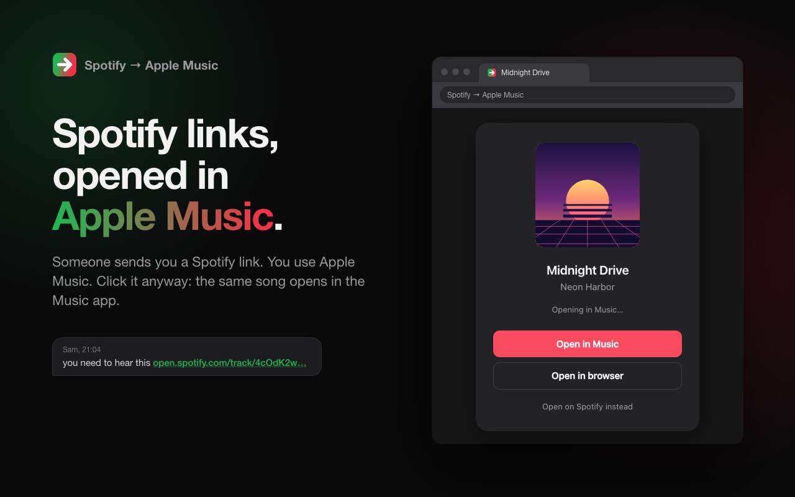

# Spotify → Apple Music

A Chrome extension that opens Spotify track, album and artist links in Apple Music instead — in the Music app (default) or in the browser. Works in Chrome, Brave and other Chromium browsers.

[Website](https://pillgates.dev/spotify-to-apple-music) · [Privacy policy](PRIVACY.md) · [Donate](https://pillgates.dev/spotify-to-apple-music#donate)

## Install

Not on the Chrome Web Store yet, so load it unpacked:

1. `git clone https://github.com/pillgat3s/spotify-to-apple-music`
2. Open `chrome://extensions` and switch on **Developer mode** (top right).
3. Click **Load unpacked** and pick the folder.
4. Pin the extension if you want quick access to the settings popup.

The first time a link is handed to the Music app, Chrome asks **“Open Music?”**. Tick **“Always allow … to open links of this type in the associated app”** and it won't ask again.

## Settings (toolbar popup)

- **On/off switch** – when off, Spotify links behave normally.
- **Open links in** – *Music app* or *Browser* (music.apple.com).
- **Tidy up the tab afterwards** – once Music has opened, the leftover tab closes itself; if the link opened in the tab you were already on, it goes back to that page instead.
- **Storefront** – the Apple Music country used for lookups and links. It defaults to the region of Chrome's UI language (`en-US` → United States), which is not necessarily where your Apple Music account lives — set it to your account's country.

## How it works

- A `declarativeNetRequest` rule reroutes `open.spotify.com/{track,album,artist}/…` navigations to `redirect.html` before any request reaches Spotify. Playlists, podcasts and the rest of the Spotify site are left alone, and so is in-player navigation in the Spotify web player.
- `lib/resolver.js` reads the item's metadata from Spotify's embed player and looks for it on Apple Music, scoring every candidate on title + artist + track length (songs) or title + artist + track count (albums), with a top-track cross-check to tell same-named artists apart. Candidates come from, in order:
  1. the iTunes Search API — fast, but its index has blind spots (new releases, smaller artists, even some famous albums);
  2. Apple Music's own web search, whose result ids are run through the iTunes lookup API so they are scored like any other candidate;
  3. the artist's discography listing.

  Matches are cached for 30 days.
- No API keys, no accounts. (song.link/Odesli would have been the obvious shortcut, but its keyless public API has been shut down.)
- The Music app gets the same link Apple's own "Open in Music" button produces: the web URL with `app=music`, under `music://`.
- If there's no confident match, it opens an Apple Music search for the artist and title **in the browser** rather than guessing — in either mode, because the Mac Music app shows an empty page for search links.
- **Open on Spotify instead** on the hand-off page lets that tab through to Spotify for as long as it stays open.

## Known limits

- Chrome only launches an external app once per user interaction with the browser. If you click several Spotify links in a row from another app without touching Chrome in between, the second hand-off page will ask for a click on **Open in Music**.
- Matching is heuristic; regional exclusives or releases missing from Apple Music end up on the search page.
- `spotify.link` short links work as long as they end up on a regular `open.spotify.com` page.

## Development

No build step and no dependencies: the folder is the extension.

- `scripts/package.sh` builds `dist/spotify-to-apple-music-<version>.zip` for the Chrome Web Store.
- `store/render.sh` regenerates the store screenshots and promo tiles from `store/src/` with headless Chrome. The popup and hand-off card in those images are built from the real `popup.html` / `redirect.html`.
- `store/listing.md` holds the store listing text, permission justifications and reviewer notes.

## Privacy

No accounts, no analytics, no server of ours. The only requests are lookups to Spotify and Apple for the link you opened. Details in [PRIVACY.md](PRIVACY.md).

## Support

If it saves you a few clicks a day, you can [donate](https://pillgates.dev/spotify-to-apple-music#donate). Bugs and wrong matches go to the [issues](https://github.com/pillgat3s/spotify-to-apple-music/issues) — include the Spotify link.

## License

[MIT](LICENSE). Not affiliated with, endorsed by or sponsored by Spotify AB or Apple Inc.
